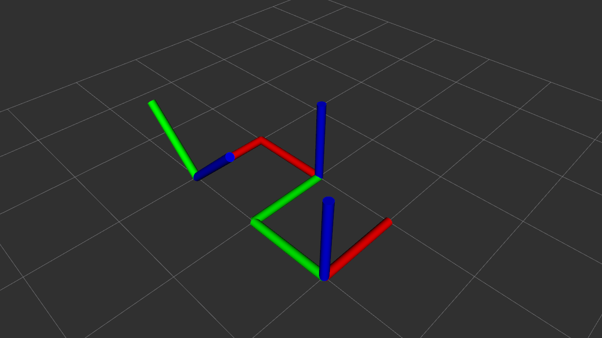

# Dual Quaternion Numpy and CasADi

This is a brief explanation of how to install and run this package on another machine.

Create a new conda environment using Python 3.8 (for example, named "dual_quat") and activate it with the following commands:

```bash
conda create -n dual_quat python=3.8
conda activate dual_quat
```
This project includes an installation file that contains all the necessary dependencies for Python and ROS. Inside the conda environment, execute the following commands:

```bash
chmod +x install_python.sh
./install_python.sh
```

## ROS Workspace

Create a ros workspace using the following commands:
```bash
mkdir -p ~/catkin_ws/src
cd ~/catkin_ws/
```
Inside the ROS workspace /src must be included:
[dual_quaternion](https://github.com/lfrecalde1/dual_quaternion).

Since the creation of the conda virtual environment, it should be activated before compiling the packages; therefore, execute the following command:

```bash
catkin_make -DPYTHON_EXECUTABLE=~/miniconda3/envs/dual_quat/bin/python
source devel/setup.bash
```
## Tutorial: DualQuaternion Operations
### Conjugate

### Norm

### Addition

### Retrieving Elements of the DualQuaternion (Real, Dual, Quaternion, and Translation)

## Tutorial Rigid Body
### Defining Different Rigid Body Frames

This section explains how to use the library to define the pose of a rigid body as a DualQuaternion object and how to display its information within rviz

The proper way to define the pose of a rigid body is described below:

```python
#Defining the Orientation Using Quaternions
theta1 = ca.SX([np.pi/2])
n1 = ca.SX([0.0, 0.0, 1.0])
q1 = ca.vertcat(ca.cos(theta1/2), ca.sin(theta1/2)@n1)

# Defining the translation
t1 = ca.SX([0.0, 1.0, 1.0, 0.0])

#Defining the Orientation Using Quaternions
theta2 = ca.SX([ca.pi/4])
n2 = ca.SX([1.0, 0.0, 0.0])
q2 = ca.vertcat(ca.cos(theta2/2), ca.sin(theta2/2)@n2)

# Defining the translation
t2 = ca.SX([0.0, 0.0, 2.0, 0.0])

# Init Dualquaternion
Q1 = DualQuaternion.from_pose(quat = q1, trans = t1)
Q2 = DualQuaternion.from_pose(quat = q2, trans = t2)
```
The proper representations of these body frames are presented below:
<p float="left">
    
 </p>

It is also possible to verify the norm of the DualQuaternion elements; the user can obtain the norm using the following commands:

```python
#Obtaining the norm of the DualQuaternion elements
Q1_norm = Q1.norm
Q2_norm = Q2.norm
```

The norm property of the elements returns the is a dual number whose real part and dual part are both positive
### Sequential Pose Transformations

In order to perform sequential pose transformations, it is only necessary to multiply the DualQuaternions. For instance, the user can define the following transformation:"
```python
# Computing a sequential transformation
Q3 = Q1 * Q2
```
The result of this operation can be visualized in the following image:
<p float="left">
    
 </p>

It is posible to replicate theese results by executing the following commad:

```bash
python Tutorial_1.py
```
## Differential Kinematics Quaternions Control

It is possible to execute quaternion-based kinematic control, where the purpose is to converge to a desired orientation.

To run the controller taking the shortest path based on numpy, execute the following command:


```bash
roslaunch dual_quaternion quat_numpy.launch
```

<p float="left">
    
 </p>

To run the controller taking the shortest path based on Casadi, execute the following command:


```bash
roslaunch dual_quaternion quat_casadi.launch
```

<p float="left">
    
 </p>

The results of this formulation are presented in the following images.

<p float="left">
    
 </p>
<p float="left">
    
 </p>

## Differential Kinematics DualQuaternions Control

To run the controller taking the shortest path based on numpy, execute the following command:


```bash
roslaunch dual_quaternion dualquaternion.launch
```

<p float="left">
    
 </p>

To run the controller taking the shortest path based on Casadi, execute the following command:

```bash
roslaunch dual_quaternion dualquaternion_casadi.launch
```
<p float="left">
    
 </p>

 
